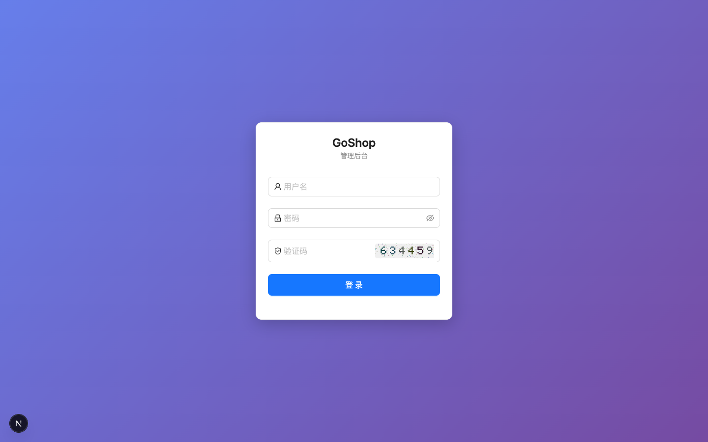
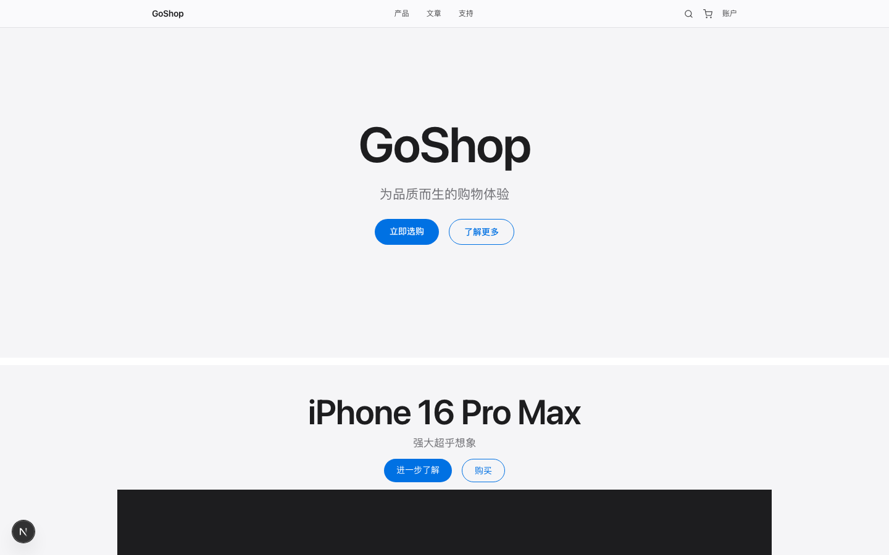
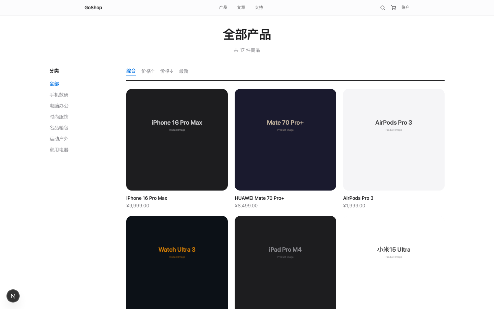

# GoShop

[](https://goreportcard.com/report/github.com/zhangpanda/goshop)
[](LICENSE)
[](go.mod)

**目标：替换 ShopXO v6.8.0 PHP 部署**——用 Go 重写同版本基线下的商城能力（数据模型、商家主路径、与 shopxo-uniapp 等约定的 `/api.php` 入口），部署上可接管原 PHP 站点职责；实现细节与分级对照见 `docs/shopxo-admin-parity.md`。**插件在线市场、PHP 式在线升级与任意 PHP 插件运行时**不在本替换范围内（管理端应用商店 Tab 为占位；扩展走 Go 工程方式）。「覆盖率约 **97%**」为团队相对 ShopXO **商家主路径**的**人工核对**结论（不含上述边界能力），**非**第三方审计。

> **ShopXO** 为独立开源项目及相应社区资产；本文提及仅用于说明替换目标与差异，**不代表**官方合作或背书。Go 后端为独立实现。DIY / Form 可视化编辑器复用其官方 MIT 子项目（[shopxo-diy](https://github.com/gongfuxiang/shopxo-diy) / [shopxo-form](https://github.com/gongfuxiang/shopxo-form)）；uni-app 对接见 [shopxo-uniapp](https://github.com/gongfuxiang/shopxo-uniapp) 与 `docs/uniapp-guide.md`。

## 特性

- **Go 后端**：Gin + GORM + MySQL，**398** 条 Gin 路由注册（`router.go` 356 + DIY/Form 41 + `/api.php` 1；以 `scripts/doc-metrics.sh` 为准）；ShopXO uni-app **`s=` 动作**当前 **94** 条（`internal/compat/shopxo/compat.go` 中 `routeMap`，以 `scripts/doc-metrics.sh` 计数为准）；12 种支付驱动，Redis 可选
- **营销功能**：秒杀（乐观锁+限购）、拼团（自动成团）、优惠券、促销
- **管理后台**：Next.js + Ant Design，72 个页面；与 ShopXO 后台为**分级对照**（已对齐 / 部分 / 占位等，见 `docs/shopxo-admin-parity.md`）
- **PC前台**：Next.js + Tailwind CSS，Apple风格UI
- **手机端**：可选用 [shopxo-uniapp](https://github.com/gongfuxiang/shopxo-uniapp)（按 `docs/uniapp-guide.md` 将 `request_url` 指到本后端站点根）；后端提供 **`/api.php` 单入口**（`s=` 动作见 `internal/compat/shopxo/compat.go` 中 `routeMap`）。**对照基线为 ShopXO v6.8.0**；其他 ShopXO 版本需自行联调验证。
- **缓存抽象**：Redis/内存缓存自动切换，无Redis也能运行
- **DIY装修**：集成shopxo-diy可视化拖拽编辑器
- **Form设计**：集成shopxo-form可视化表单设计器

## 截图预览

以下为仓库内随版本更新的 **实机截屏示例**（分辨率与数据为截取时环境；**若与当前界面不一致**，请以本地启动为准或自行更新图片）。

| 管理端登录 | PC 前台首页 | PC 商品列表 |
|:---:|:---:|:---:|
|  |  |  |

更多页面见 `docs/screenshots/product-detail.png`。更新管理端截屏：仓库根目录以 `GOSHOP_E2E=1` 启动后端后执行 `cd admin && npx playwright test e2e/readme-screenshots.spec.ts`，可生成 `admin-login.png`、`admin-dashboard.png`、`admin-goods.png`（覆盖同名文件前请自行备份）。

## 快速开始

### Docker 一键部署

```bash
git clone https://github.com/zhangpanda/goshop.git
cd goshop
cp config.yaml.example config.yaml
# 编辑 config.yaml：
#   db.host 改为 mysql
#   db.password 改为 goshop123（与 docker-compose.yml 中 MYSQL_ROOT_PASSWORD 一致）
#   redis.host 改为 redis（或留空使用内存缓存）
# 生产相关：trusted_proxies / cors_origins / sql_console 见 config.yaml.example 与 docs/deployment.md
docker compose up -d
# 后端 API: http://localhost:8080
# 管理后台和 PC 前台需另行启动（见下方本地开发步骤）
```

> Docker 镜像仅包含 Go 后端（**`Dockerfile`** 构建阶段：`golang:1.25.10-alpine`，与 `go.mod` / CI 一致）。管理后台（Next.js :3010）和 PC 前台（Next.js :3000）需在宿主机或单独容器中运行。首次启动仍会创建默认管理员，**公网前须改密**（见 [部署指南](docs/deployment.md)）。

### 本地开发

#### 环境要求
- Go **1.25.10**（`go.mod` 声明 **`go` + `toolchain`**；CI、**`Dockerfile`**（`golang:1.25.10-alpine`）、可选 **`mise.toml`** / **`.tool-versions`** 与之对齐；勿混用 1.24.x 旧链，否则需自行降级 `github.com/gin-gonic/gin` 等到 v1.10.x）
- Node.js 20+（与 Next.js 15 实践一致）
- MySQL 5.7+ / 8.0+（推荐 8.0）
- Redis 6+（可选，不配置则使用内存缓存）

### 1. 启动后端
```bash
git clone https://github.com/zhangpanda/goshop.git
cd goshop
cp config.yaml.example config.yaml  # 修改数据库密码等配置；反代部署见 docs/deployment.md（trusted_proxies 等）

# 创建数据库（首次）
mysql -uroot -p -e "CREATE DATABASE IF NOT EXISTS goshop CHARACTER SET utf8mb4;"

go build -o bin/goshop cmd/server/main.go
./bin/goshop
# 服务运行在 http://localhost:8080
# 首次启动自动建表、创建默认管理员(admin/admin123)、初始化商品等示例数据
```

### 2. 启动管理后台
```bash
cd admin
npm install
npm run dev
# 访问 http://localhost:3010/login
# 默认账号: admin / admin123
```

> ⚠️ **安全提醒**：默认管理员密码仅供开发使用。部署到公网前**必须修改密码**，否则等于将管理后台完全暴露。详见 [部署指南](docs/deployment.md)。

### 3. 启动PC前台
```bash
cd web
npm install
npm run dev
# 访问 http://localhost:3000
```

> 管理后台和 PC 前台默认将 `/api/*` 代理到 `localhost:8080`。如后端地址不同，需修改对应 `next.config.js` 中的 `rewrites` 配置。

### 4. 对接uni-app手机端
```bash
# 克隆 shopxo-uniapp（社区维护；与 GoShop 无隶属关系，仅对接参考）
git clone https://github.com/gongfuxiang/shopxo-uniapp.git
# 修改 common/config.js 中的 request_url 为 http://你的IP:8080
# 用HBuilderX打开运行即可
```

### 5. DIY装修器（可选）
```bash
git clone https://github.com/gongfuxiang/shopxo-diy.git
cd shopxo-diy
npm install --legacy-peer-deps
npx vite build
# 将 dist/static/diy 复制到 goshop/static/diy
# 将 dist/index.html 复制到 goshop/static/diy.html
```

### 6. Form表单设计器（可选）
```bash
git clone https://github.com/gongfuxiang/shopxo-form.git
cd shopxo-form
npm install --legacy-peer-deps
npx vite build
# 将 dist/static/form_input 复制到 goshop/static/form_input
# 将 dist/index.html 复制到 goshop/static/form.html
```

## 项目结构

```
goshop/
├── cmd/server/main.go          # 入口
├── internal/
│   ├── handler/                # HTTP处理器（以 scripts/doc-metrics.sh 计数为准）
│   ├── service/                # 业务逻辑（以 scripts/doc-metrics.sh 计数为准）
│   ├── model/                  # 数据模型 (34个 Go 文件, 95张表，以 AutoMigrate / doc-metrics 为准)
│   ├── router/router.go        # 路由注册 (356 条 Gin；全站合计 398 见 doc-metrics/HANDOVER)
│   └── middleware/             # 中间件 (JWT/CORS/操作日志)
├── admin/                      # 管理后台 Next.js（page 数以 doc-metrics 为准）
├── web/                        # PC前台 Next.js (24页面)
├── static/                     # DIY/Form构建产物
├── pkg/                        # 公共包 (JWT/缓存/微信支付/响应)
├── config.yaml                 # 配置文件
└── go.mod
```

## 管理后台功能

| 模块 | 功能 |
|------|------|
| 仪表盘 | 10个报表图表，今日/昨日/周/月切换，待处理事项 |
| 商品 | 商品管理/分类/评论/浏览/收藏/购物车/参数模板/规格模板 |
| 订单 | 订单管理/售后，独立详情页，发货/物流轨迹/打印 |
| 用户 | 用户列表/地址，编辑积分/余额 |
| 网站 | 导航/轮播/链接/快递/地区/筛选价格/自定义页面/支付方式/附件/表单/主题/设计/布局/快捷导航/菜单 |
| 品牌 | 品牌管理/品牌分类 |
| 数据 | 消息/支付日志/积分日志/退款日志/短信日志/邮件日志/错误日志/搜索记录/操作日志 |
| 文章 | 文章管理/文章分类 |
| 手机 | 首页导航/基础配置/小程序配置/用户中心导航/DIY装修 |
| 应用 | 插件安装/卸载/配置（元数据）；**应用商店 Tab 占位，无内置市场计划**（见 `HANDOVER.md` 产品边界） |
| 仓库 | 仓库管理/仓库商品 |
| 系统 | 系统配置(12分组77项)/商店信息/多语言与货币 |
| 站点 | 站点设置/短信/SEO/邮箱/协议 |
| 权限 | 管理员/角色/权限分配 |
| 工具 | 缓存管理/SQL控制台 |

## 支付驱动

微信支付(JSAPI/H5/APP/Native) + 支付宝(PC/H5/APP/小程序/面对面) + PayPal + 钱包余额 + 线下支付

## 数据库

- **95** 张表（`AutoMigrate` 模型数；可运行 `scripts/doc-metrics.sh` 核对），表与字段含中文注释
- 首次启动自动建表（`RunAllSchemaMigrations`：SQL 版本占位 + GORM AutoMigrate，详见 `docs/deployment.md`）
- 自动初始化：默认管理员、系统配置(77项)、快递公司(14家)、省市区(3447条)

## 与 ShopXO 的对比（简要）

| 维度 | ShopXO | GoShop |
|------|--------|--------|
| 语言 | PHP (ThinkPHP) | Go (Gin + GORM) |
| 架构 | 前后端一体 | 前后端分离 |
| 后端体量（粗算） | 约 14.5 万行（PHP，含模板等，口径见 `HANDOVER.md`） | 约 1.73 万行（Go，`internal`+`pkg` 等） |
| 管理后台 | PHP 模板 | React + Ant Design |
| PC 前台 | PHP 模板 | Next.js + Tailwind |
| 典型部署 | PHP + Web 服务器 + MySQL 等 | 单二进制 + MySQL（Redis 可选） |
| **部署目标（相对 v6.8.0）** | 官方 PHP 商城 | **以 Go 替换同名职责**（数据与主路径见迁移/parity 文档；插件市场等除外） |
| 与商家主路径对齐 | 以官方版本为准 | 约 97%（**人工对照**，不含插件市场/PHP 式升级等；见 `HANDOVER.md` 与 `shopxo-admin-parity.md`） |

性能、并发表现取决于业务与压测场景，**未**与 ShopXO 做同等条件下的公开对标测试，不在此表下结论。

## 贡献

欢迎提交 Issue 和 Pull Request，详见 [CONTRIBUTING.md](CONTRIBUTING.md)。

## 文档

| 文档 | 说明 |
|------|------|
| [安全政策](SECURITY.md) | 漏洞报告渠道与已知安全边界 |
| [第三方声明](NOTICE) | DIY/Form 静态资源与前后端依赖的归属说明（合规查阅） |
| [API 文档](docs/api.md) | 接口说明（公共/用户/管理后台及 `/api.php` 兼容；以源码为准） |
| [ShopXO 迁移指南](docs/migration-from-shopxo.md) | 从 ShopXO 迁移数据到 GoShop |
| [二次开发指南](docs/development.md) | 项目架构、添加接口/页面/支付方式的流程 |
| [部署文档](docs/deployment.md) | Docker/手动/Systemd 部署 + Nginx 配置 |
| [uni-app 对接指南](docs/uniapp-guide.md) | ShopXO uni-app 前端对接说明 |
| [ShopXO 后台对齐清单](docs/shopxo-admin-parity.md) | 管理端模块与 ShopXO 对照（已对齐 / 部分对齐 / 占位 / 不适用） |
| [可观测性 & SLO](docs/observability.md) | Prometheus 指标、SLO/告警规则、Runbook；配合 `deploy/prometheus/` |
| [PayPal 对接](docs/paypal.md) | Orders v2 REST 接入：凭据获取、支付/捕获/退款/Webhook 流程 |
| [Web 前台](web/README.md) | PC 前台开发说明 |
| [管理后台](admin/README.md) | 管理后台开发说明（含 Playwright E2E） |
| [`scripts/doc-metrics.sh`](scripts/doc-metrics.sh) | 规模指标统计（路由/表/页面/测试数等），与 `HANDOVER.md` 对齐 |

## 开源协议

[Apache License 2.0](LICENSE)
